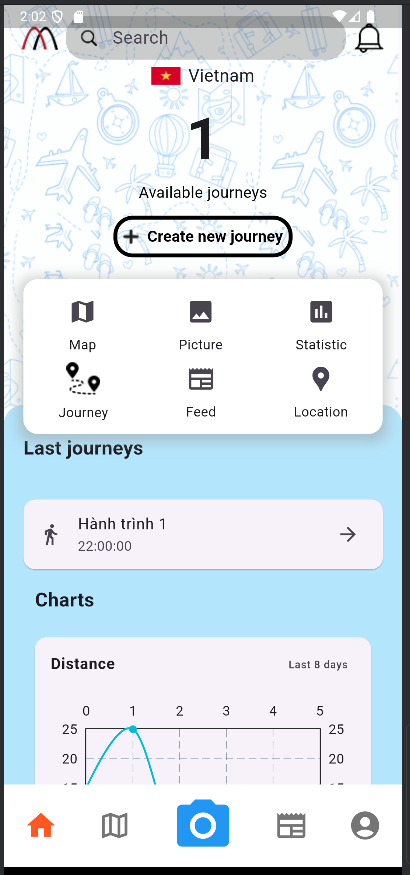
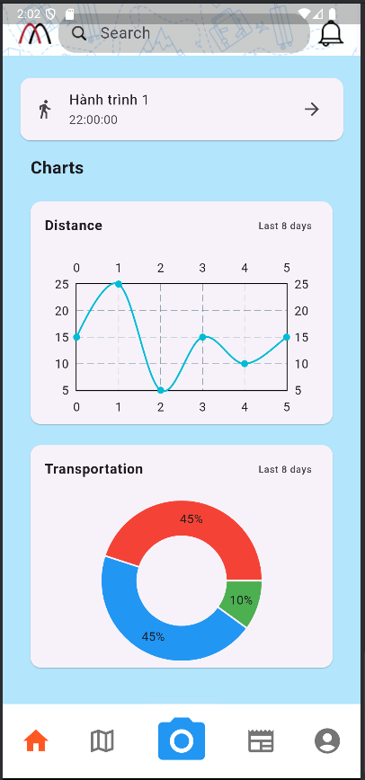
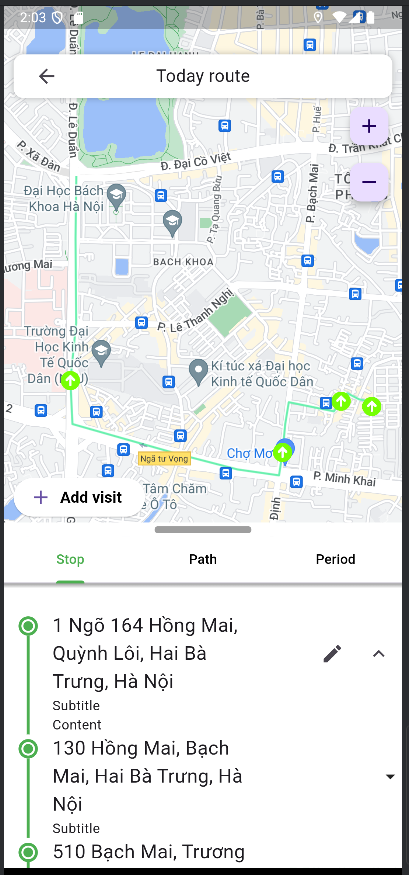
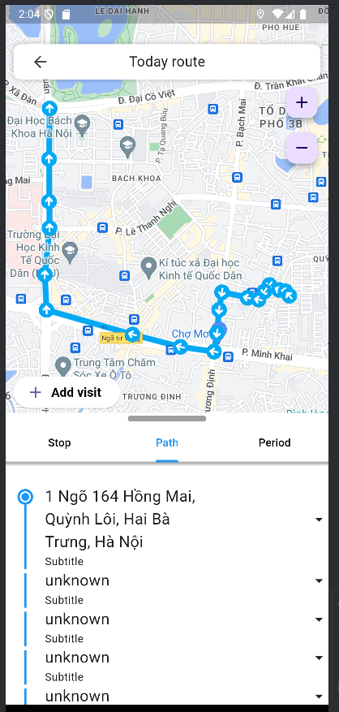
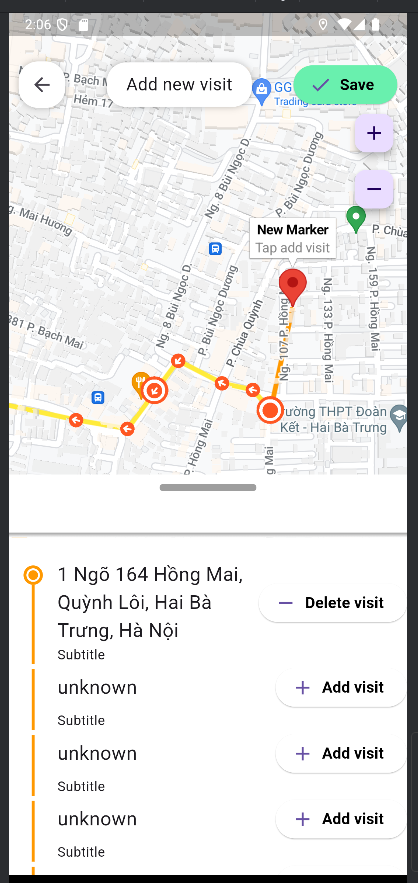
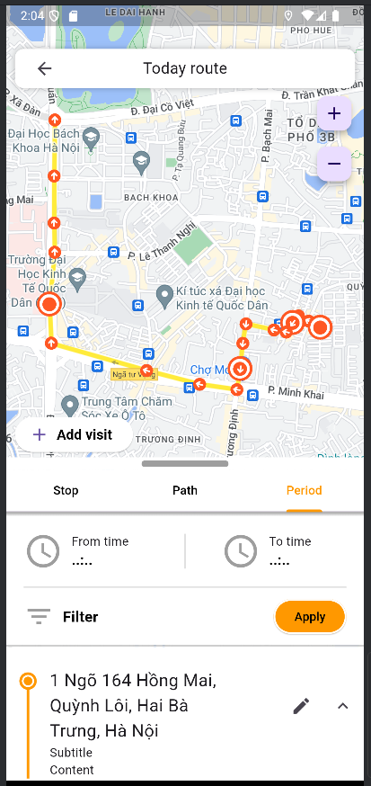

# MapSnap

## Giới Thiệu
**MapSnap** là một ứng dụng di động giúp người dùng tạo lập lịch trình di chuyển, lưu lại các địa điểm đã ghé qua, và chia sẻ hành trình lên mạng xã hội. Ứng dụng được phát triển trong khuôn khổ bài tập lớn môn **Nhập môn Công nghệ phần mềm** tại Trường Đại học Bách khoa Hà Nội.

### Tính năng chính
- **Quản lý hành trình**: Lưu lại lịch sử di chuyển, hiển thị địa điểm đã ghé qua.
- **Quản lý ảnh**: Chụp và gán thẻ địa điểm và thời gian cho ảnh.
- **Chia sẻ mạng xã hội**: Tương tác với bạn bè qua các bài đăng, bình luận, và thích.
- **Xác định vị trí**: Tích hợp API Goong để ghi nhận và chuyển đổi tọa độ GPS.

## Demo

  
  
  
  
  
  

Chi tiết hơn về tính năng app: https://www.youtube.com/watch?v=PRvlo7mVIQQ&t=31s

## Kiến Trúc Dự Án
- **Frontend**: Sử dụng Flutter để tạo giao diện.
- **Backend**: Express.js (Node.js), MongoDB cho cơ sở dữ liệu.
- **Tích hợp**:
  - Google Maps API để hiển thị bản đồ.
  - Goong API để chuyển đổi tọa độ GPS sang địa điểm.

---

## Hướng Dẫn Sử Dụng
- **Tạo tài khoản**:
  - Nhập email, tên, mật khẩu.
  - Xác nhận qua email.
- **Chụp ảnh và lưu địa điểm**:
  - Mở camera tại giao diện chính.
  - Ghi nhận thời gian và địa điểm chính xác.
- **Quản lý hành trình**:
  - Xem và sắp xếp hành trình theo ngày hoặc địa điểm.
- **Chia sẻ mạng xã hội**:
  - Đăng bài, bình luận, và tương tác với bạn bè.

---

